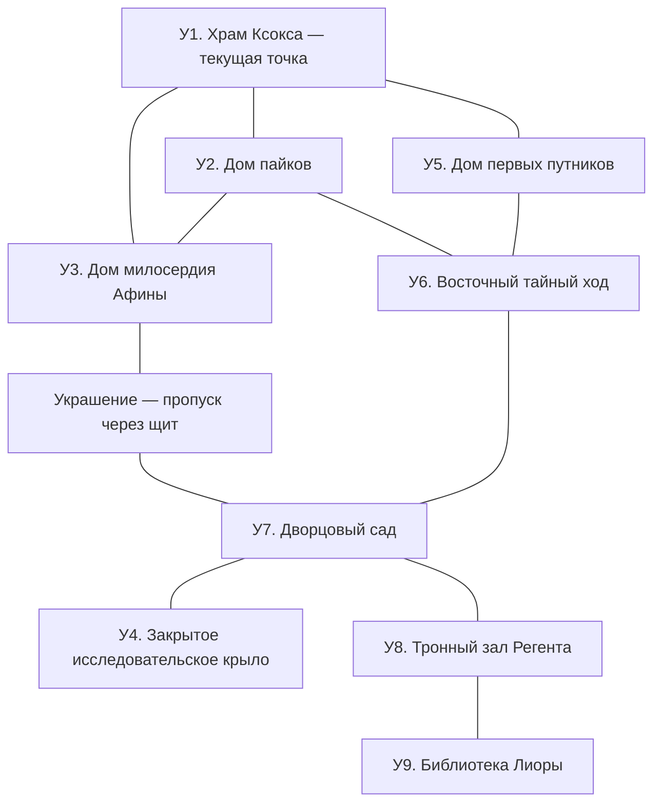

# Унориэль: город за двумя щитами

**Приключение для шести персонажей 6-го уровня. Продолжительность: две-три сессии по 4–6 часов.**

Под морем стоит первый город эльфов Авалона: столица Мииры и третья столица Элдранской Империи. Щит сохранил его улицы, но не спас жителей от голода. Теперь часть погибших снова стоит в очереди за хлебом. Во дворце ещё горит свет, а его правитель ждёт помощи, не замечая проходящих столетий.

Герои ищут записи о Скипетре Владычества. Путь ведёт через последние убежища горожан, закрытое исследовательское крыло и тронный зал. Здесь можно узнать, как инструмент освобождения стал орудием подчинения, и спасти тех, кто оставил остальных умирать.

Уже сыгранное перечислено ниже; дальнейшие сцены подготовлены для игры. [Приложение](<Унориэль — существа и находки.md>) содержит характеристики, предметы и раздаточные материалы. [Редакторская справка](<Унориэль — источники новой редакции.md>) отделяет источники от авторских решений.

## Начало следующей сессии

Герои вошли в город, нашли первую страницу дневника, отбились от мертвецов и пришли в храм Ксокса. Восемь диатонических колокольчиков и надпись «Клетка» подсказали последовательность **C–A–G–E**. Она открыла крипту. Повторив услышанную там мелодию, герои получили книгу о Ксоксе. Дакира почувствовала близость этого места.

**Продолжите в крипте, в области У1.** Решённые загадки не повторяются. Вайнона уже посоветовала искать ключ к дворцовому щиту в больших зданиях, где укрывались горожане.

### Что предстоит сделать

1. Найти украшение, позволяющее пересекать внутренний щит, или восточный тайный ход.
2. Войти в исследовательское крыло дворца и получить ранние записи о скипетре.
3. Пройти охрану тронного зала; обнаружить и освободить семью префекта.
4. Добраться до библиотеки и сопоставить раннюю разработку с поздним императорским исследованием.

Храм Ксокса и дом Алентар дают личные открытия. Их можно исследовать, не принимая новых обязательств перед Вайноной. Скипетр не требуется приносить с собой.

## Тайны города

Прочтите этот раздел до игры. Его содержание не сообщается героям одним рассказом.

**Первое поселение.** От времени Прибытия сохранились храм Ксокса и дом первых Алентар. Храм хранит историю местного избранного, а не семейный архив Вотума. Ко времени катастрофы дом Алентар уже перестал быть действующим транспортным аванпостом; подробности и свидетельства находятся в У5.

**Столица Мииры.** Унориэль возглавлял союз с Дуориэлем и Тресиэлем. Будущий скипетр разрабатывали в охраняемом крыле миирского дворца. Маги искали способ разорвать одну выбранную связь, сохранив остальные. До имперского захвата предмет и основную разработку вывезли в Аманию. Чертежи и учебные устройства остались в закрытом крыле.

**Третья столица Империи.** Город пал в 488 году до Элементальной войны. В 484 году Килиан сделал его третьей столицей; в 464 году воскресший Эрин вновь подчинил город. Дворец перестроили, сохранив старое исследовательское крыло под контролем короны. Примерно за триста лет до затопления имперцы заново укрепили городской щит.

**Поздние исследования.** Гораздо позже Эрин завладел скипетром в Амании. Предмет вывезли в Эльтуриэль и переделали во Владычество в Латерии. Во время отдельного позднего визита его доставили в закрытое дворцовое крыло Унориэля для сравнения с ранней разработкой. Это не возвращение Эрина в 464 году. Исследованиями руководила эльфийка **Лиора Нэлис**. Среди пленённых подопытных был водный элементаль **Иррис**.

**Некротический отпечаток.** Лиора выявила способность позднего оружия сохранять приказ после смерти подопытного. После отъезда скипетра осталась каронитовая призма с отпечатком воздействия. Её встроили в испытательного стража **Регента**. Сейчас этот источник оживляет останки людей, дварфов и гномов, а городская сеть передаёт им приказы. **Проклятие Миркула не действует на эльфов: их останки не оживают.** В модуле нет исключения через «особую местную некромантию». Лиора — запись личности, Мерет — автомат, а не эльфийская нежить.

**Последние дни.** На пятнадцатый день после затопления префект **Каллис Вэрен** закрыл дворец вторым щитом. Он отказался впустить всех, объясняя это запасами пищи и воздуха. Когда стало ясно, что спасатели не придут вовремя, дворцовые маги остановили время для него, его супруги **Мирены** и дочери **Сэлии**. Восемнадцатый день для них ещё не закончился. Остальные укрывшиеся во дворце умерли. Сам Каллис не вызывал катастрофу; ответственность за отказ горожанам остаётся на нём.

**Охрана трона.** Перед стазисом Регента перевели из лаборатории в тронный зал и поручили охранять семью и внутренние покои, включая библиотеку. Система распознаёт пробуждённого префекта и подчиняется ему. Сила призмы через работающую городскую сеть и поддерживает оживление, и передаёт команды: останки собираются на несуществующую выдачу пайков. Разрыв этой связи лишает местные тела обоих воздействий. Отключение прекращает местный очаг, но не лечит весь Авалон; извлечённая призма остаётся опасна рядом с открытым образцом.

**Лиора.** Исследовательница умерла вскоре после подготовки стазиса. Перед смертью она сохранила личность в архивном кристалле библиотеки. Она знает историю своих опытов, но не события последующих веков. Её нынешняя цель — дать живым возможность исправить причинённый вред.

## Исследование города

### Общие свойства

- **Воздух.** На улицах и в обычных зданиях мало кислорода. Маски группы работают весь модуль, позволяют говорить и произносить компоненты заклинаний. Урон сам по себе их не ломает. При добровольном снятии действуют обычные правила задержки дыхания. Маски не дают скорости плавания или возможности выйти в открытое море.
- **Свет.** За внешним куполом — тёмная вода. Обычное пламя гаснет; магический свет и заклинания огня действуют нормально. Сад, жилые покои и библиотека освещены слабо светящимися панелями.
- **Два щита.** Внешний удерживает море. Внутренний закрывает дворец и сад. Украшение-пропуск из У3 позволяет носителю пересекать внутренний щит; оно не открывает ворота для толпы и не отключает защиту. Восточный ход У6 проложен ниже основания внутреннего щита. Тронная охрана и стазис — отдельные системы.
- **Народы города.** При Империи в столице жили эльфы, люди, дварфы и гномы. Вся встреченная нежить принадлежит трём последним народам. На эльфийских телах сохраняются бирки и одежда, но нет признаков оживления. Это наблюдаемое различие, а не лекция о Миркуле.
- **Переходы.** Между соседними городскими местами около десяти минут осторожного пути, между соседними дворцовыми областями — две минуты. Нумерация обозначает места, а не обязательный порядок посещения.
- **Языки.** Надписи преимущественно эльфийские. Вайнона переводит по просьбе. Существенные сведения не требуют отдельного броска расшифровки.
- **Магия.** Снаряжение и способности действуют как обычно. Удачное перемещение или проникновение может обойти охрану; такой успех не отменяется новым запретом. «Рассеивание магии» взаимодействует с конкретными эффектами, как указано в сценах.
- **Отдых.** Крипта У1 и дом Алентар У5 подходят для короткого отдыха; сад У7 — для долгого. Долгий отдых восстанавливает хиты уцелевших противников, но не возвращает уничтоженные механизмы и не включает отключённые колонны.

**Вайнона.** Переводит, помогает раненым и выполняет порученную практическую работу. Она не знает решений заранее. У входа в тронный зал обращает внимание на неподвижную семью; по просьбе помогает с колонной или защищает отступающих. Её экспедиционный профиль приведён в приложении.

### Пути по городу

Из города нет входа непосредственно в исследовательское крыло. Его дверь открывается из дворцовой галереи за внутренним щитом. Библиотека находится за тронным залом; обычный путь к ней проходит мимо Регента.

### События на улицах

Используйте каждое событие не более одного раза.

| Событие | Что происходит |
|---|---|
| Последняя очередь | Человеческие и дварфийские мертвецы несут пустые миски в У2, обходя неподвижное тело эльфа. За ними можно проследить. |
| Приказ из дворца | Бронзовая маска объявляет: «Подданным вернуться к месту учёта». В глазницах мертвецов вспыхивает тот же свет. Сорванная со стены за минуту маска перестаёт передавать приказ в переулок. |
| Серебряное крыло | На сломанной статуе Арандила под имперской табличкой сохранилось: «Наш союзник. Не наш слуга». Рядом — указатель к дворцу и его миирскому крылу, У4. |
| Чужое дыхание | У разбитого бронзового носильщика сохранились два фильтра и инструменты: ими можно починить повреждённое по обстоятельствам игры дыхательное устройство за десять минут. |

## У1. Храм Ксокса

Первый этаж, восемь колокольчиков, загадка C–A–G–E, мелодия крипты и найденная книга остаются такими, какими их уже видели игроки. Продолжите после чтения книги. Дальнейшая часть храма занимает около часа игры.

> За подставкой для книги видна узкая дверь. На ней изображены весы: в одной чаше лежит мост, в другой — раскрытая ладонь. Под рисунком написано: «Поддержи идущего. За дар отдай своё». Дверь открывается от толчка.

За дверью расположены два испытания и зал наследников. Надписи объясняют правила; храм ничего не требует тайно. Обратный путь всегда открыт. Здесь действуют общие правила воздуха и освещения Унориэля.

### 1. Переход на весах

> Через провал перекинут узкий бронзовый мост. На ближнем берегу стоят две рычажные рукояти. От них к мосту идут цепи. На противоположной стене высечены две фигуры: одна переходит, другая удерживает весы.

**Обстановка.** Зал шириной 20 футов. Провал длиной 30 футов и глубиной 10 футов занимает пространство между берегами. Мост шириной 5 футов состоит из двух подвижных половин. Левая рукоять удерживает первую, правая — вторую. Если отпустить рукоять, соответствующая половина медленно наклоняется вниз. Рядом лежат два бронзовых противовеса и прочный канат длиной 50 футов.

**Задача.** Переправить группу. Два героя могут держать рукояти без проверок, пока остальные переходят. Основная трудность — переправить удерживающих. Противовесы предназначены именно для этого: их нужно подвесить к концам рукоятей и зафиксировать канатом. Отверстия для крепления хорошо видны. Такой план занимает десять минут и работает без броска. Можно также заклинить рукояти инструментами, закрепить сам мост или переправиться магией.

**Рискованный путь.** Без поддержки герой может перебежать обе половины: Ловкость (Акробатика), Сл 15. При провале он падает на 10 футов и получает 1к6 дробящего урона. Заранее привязанный канат предотвращает падение. Со дна можно подняться по цепям без проверки; выход из испытания не перекрывается.

**Результат.** На дальней стороне висит бронзовый жетон с изображением моста. Его можно снять. Это храмовый знак пройденного пути; устройство не оценивает нравственность героев и не наказывает за изобретательный обход.

### 2. Цена открытой руки

> На каменной ладони лежат три стеклянные чаши. За ними видна дверь с тремя круглыми углублениями. Над чашами написано: «Отданное наполняет. Взятое опустошает». Под каждой выгравированы одинаковые условия обмена.

**Условия.** Чтобы открыть дверь, нужно наполнить три чаши. Одно наполнение стоит **одной Кости хитов**, **ячейки заклинания 1-го уровня или выше** либо **25 золотых**. Ресурс добровольно отдаёт коснувшийся чаши; расход Кости хитов не причиняет урона и не лечит. Кости и ячейки восстанавливаются обычным образом. Монеты исчезают. Более высокая ячейка всё равно наполняет одну чашу; надпись предупреждает об этом. Плату можно распределить между спутниками.

**Баланс платежа.** За каждую полную чашу появляется серебряный жетон. Если забрать его, чаша остаётся наполненной, но отданный ресурс уже не возвращается. Пока жетон лежит на месте, герой может отменить свой обмен и получить плату обратно. Это позволяет испытать устройство без необратимого решения.

Бронзовый жетон из первого зала заменяет одну плату: поддержка спутников уже считается вкладом. Для открытия двери нужны три жетона — бронзовый и два серебряных либо три серебряных.

**Другие решения.** Механический замок двери можно открыть воровскими инструментами: Ловкость, Сл 18; попытка занимает десять минут. Провал заклинивает механизм, но жетоны по-прежнему работают. Силой дверь открывается совместным усилием двух героев: Сила (Атлетика), Сл 20. При провале срывается каменная рукоять: оба получают 1к6 дробящего урона. Дверь остаётся цела, повторить попытку можно ломом. Обход не уничтожает исторические записи или награду.

### Зал наследников

> На стене вырезано родословное дерево. В его верхней ветви — эльф с чашами весов, ниже — пять портретов. В центре зала стоит открытая шкатулка с медальоном. На её крышке написано: «Своя воля».

Плита посвящена **Саэрину Велю, избранному Ксокса на Авалоне**. Он отдельный исторический персонаж. Это не имя или обличье Вотума. Под портретом названы дети Саэрина — Алисса и Дерен; ниже — дети Алиссы, Элиас и Наэри, и дочь Дерена, Саэла. Числа у ветвей обозначают порядок наследования храмовой печати. Никакие линии не оживают при приближении героев.

Рядом лежит книга хранителей. Между первым и последним собственноручно подписанными распоряжениями Саэрина прошло **912 лет**. Последняя запись сообщает, что он отплыл из Унориэля, оставив печать Алиссе. Дата предшествует затоплению; следующая запись, уже другой рукой, описывает закрытое морем небо. Хранитель прямо пометил, что избранный не вернулся к моменту катастрофы. Его последующая судьба здесь не известна.

**Воспоминание Дакиры.** Рассматривая расположение ветвей, Дакира может совершить проверку Интеллекта (История), Сл 20. При успехе она вспоминает, что многократно видела похожую родословную на Эреде. Из имён различает **Вотум**; остальные и собственное место в дереве остаются неясными. При провале сохраняется только знакомое ощущение. Плита не подтверждает её родство: это повод вернуться к собственной памяти и расспросить Грантера.

**Награда.** Медальон «Своя воля» — храмовый дар прошедшим испытания. Его свойства приведены в приложении; он не принадлежит дому Вотума и не заключает нового договора. На боковой стене изображены первая пристань эльфов и знак Алентар, указывающий на дом У5. С крыльца доступны У2 и У3.

## У2. Дом пайков

> Между столами стоят фигуры с пустыми мисками. У многих видны человеческие или дварфийские черты. Эльфийские тела неподвижно лежат вдоль стены. За прилавком бронзовый раздатчик в истлевшем переднике водит пальцем по книге. На его груди выбито имя «Мерет». В котле перед ним нет ничего.

**Размеры.** Зал 60 × 40 футов; три ряда столов дают укрытие наполовину. На северной стене висит маска городской связи.

**Мерет.** Разумный служебный конструкт, работавший здесь ещё при живых горожанах. Сохранил память о последних днях. Из дворца приходит приказ продолжать выдачу, а пустой склад не позволяет выполнить его. Мерет хочет закончить эту смену. Первая фраза: «Если принесли хлеб — сюда. Если пришли за хлебом — мне нечего вам дать». Он не нуждается в пище и воздухе и не является нежитью.

### Разговор с Меретом

Уважительный разговор, настоящая еда или помощь с книгой учёта позволяют спокойно осмотреть зал. Он сообщает:

- Придворный огранщик **Орен Таль**, эльф, вышел из дворца уже после появления второго щита. Искал супругу **Лаэну**, помогавшую в Доме милосердия У3. Мерет отправил его к боковому входу: главный тогда завалило. Как Орен пересёк щит, автомат не видел.
- Последняя группа голодных собиралась искать восточные подвалы У6. Она спрашивала дорогу у раздатчика; отсюда и запись в его памяти.
- Мёртвые подчиняются маске; эльфийские тела никогда не вставали. Мерет заметил это, но причины не знает.

**Вторая страница дневника.** Автор оставил её между листами книги выдачи перед походом к дворцу. Мерет отдаёт страницу по просьбе. Выдайте вторую страницу существующего PDF без изменений. Судьба автора этим не устанавливается.

### Нападение очереди

Разговор не запускает бой. Если герои нападают на очередь, ломают Мерета или лезут за прилавок после предупреждения, поднимаются **две толпы голодающих** и **два мёртвых надзирателя**. Толпы состоят из людей, дварфов и гномов; надзиратели — люди. Мерет прячется и не участвует.

**Задача.** Прекратить приказ или пробиться к выходу. Маска: КД 15, 25 хитов, иммунитет к яду и психическому урону. Рядом с ней можно действием вырвать проводники: Сила (Атлетика) или Интеллект (Магия), Сл 14. Отключение прекращает нападение толп; надзиратели сохраняют последнюю команду. Изгнание нежити действует нормально; Мерет к нему невосприимчив как конструкт.

**Колокольчики.** Звон раздачи и Харизма (Выступление) Сл 13 действием направляют одну толпу к дальнему столу. До начала следующего хода исполнителя она не атакует; урон прекращает отвлечение. После одной успешной попытки приём больше не работает в этой встрече.

**Награда.** После отключения маски Мерет открывает ящик с 240 зм: «Мне больше нечем платить». При уничтоженном автомате ящик открывается инструментами или силой за десять минут. Мерет может остаться в городе в режиме ожидания или отправиться с группой, если его позовут; он не исчезает и не «обретает покой» как дух.

**Дальше.** У3 — поиск Орена; У6 — восточные подвалы. Наблюдение о неподвижных эльфах повторится в других местах.

## У3. Дом милосердия Афины

> Под каменной совой тянутся ряды носилок с именными бирками. Громадная трещина рассекла балкон и похоронила боковую комнату. На стене сохранился список добровольцев. Последнее имя — «Лаэна Таль».

Жрица **Талея** принимала всех. Лаэна, супруга придворного огранщика Орена, осталась помогать больным, когда дворец закрыл щит. Орен получил гостевое украшение за работу с камнями дворцовой защиты; в ночь семнадцатого дня он покинул дворец, чтобы найти её. Вошёл со стороны служебного двора, где ещё не рухнули перекрытия. Обвал запер их вдвоём в боковой комнате. Он остался с умирающей супругой и не вернулся. К утру следующего дня последние способные ходить жители уже покинули храм.

### Поиск боковой комнаты

Список добровольцев и записка Талеи указывают, где лежала Лаэна. Мерет даёт имя Орена и маршрут, но обыск храма работает и без разговора с ним. Через трещину видно два прижатых друг к другу эльфийских тела. Ни одно не оживает. Украшение под одеждой отсюда не видно.

- **Безопасно разобрать завал:** два героя и найденные балки, двадцать минут без проверки.
- **Пройти через окно служебного двора:** десять минут обхода; узкая рама требует протискивания Среднего существа. Внутри можно обследовать тела без движения опасных камней.
- **Быстро раздвинуть плиты:** действие, Сила (Атлетика) Сл 15. Успех открывает проход. При провале подпорка начинает рушиться; у группы есть полный раунд, чтобы отойти или удержать её ещё одной такой проверкой. Затем спасбросок Ловкости Сл 14: 3к6 дробящего урона, половина при успехе. Находки сохраняются под обломками.

### Украшение посетителя

У Орена под застёгнутой одеждой находится **брошь с чёрным опалом**. Рядом — дворцовый футляр с его именем и надписью: «Гостевой допуск. При переходе держать в руке. Защита признаёт носителя, не его имя». В нагрудном кармане записка супруге: «Я пройду за тобой, Лаэна. Если ты ещё можешь идти, вернёмся вместе».

**Почему ею не воспользовались горожане.** Орен не выступал перед толпой и не показывал допуск. Он пришёл через пустой служебный двор; обвал закрыл комнату вскоре после его прихода. Украшение выглядело обычной драгоценностью и осталось скрытым под одеждой. У нуждавшихся не лежал на виду опознанный ключ.

**Как работает пропуск.** Существо, держащее брошь рукой, может пройти через внутренний щит в любую сторону. Брошь сохраняет допуск, пока её держат с обеих сторон; два человека могут передавать её из рук в руки сквозь границу. Группа переправляется по одному, последний проходит с брошью. Она не привязана к расе, не требует настройки и не отключает щит. Снятая с руки брошь сама не проходит сквозь защиту: перебросить её нельзя. Правило передачи показано рисунком внутри футляра.

### Память о жителях

Мейв узнаёт алтарь Афины. Уход за телами, восстановление бирок или тщательный осмотр открывают медицинский шкаф с **тремя целебными настоями**. Каждый восстанавливает 2к4 + 2 хита действием. В журнале Талеи записаны имена и судьбы её смены. Забота о них даёт рассказ о людях, которые оставались с больными, пока дворец запирался; магическая награда не требует правильной молитвы.

**Дальше.** Украшение даёт вход в сад У7. По открытому лицу щита видно, что за ним есть пригодное для дыхания пространство.

## У4. Закрытое исследовательское крыло

**Вход — только из дворца, через галерею сада У7.** Со стороны города у крыла глухая стена, без двери и окон. В миирские времена здесь работали мастера короны; имперцы сохранили изоляцию, добавили караульную и камеры подопытных. При позднем визите скипетр везли из личных покоев Эрина под охраной. На улицу его не выносили.

> На массивной внутренней двери вырезаны три миирских корабля. Поверх прикреплена имперская корона и табличка: «Допуск исследователей и сопровождаемого персонала». За дверью видна пустая караульная. Дальше расходятся две галереи: к старой мастерской и к камерам испытаний.

Дверь опечатана обычным лабораторным замком: Ловкость с воровскими инструментами Сл 15 либо двадцать минут аккуратной работы без броска. Ключ можно найти при теле коменданта дворцовой охраны в сторожке У7; на связке отмечено «исследовательское крыло». Пока дворец был обитаем, у двери также стоял караул. Гостевая брошь не отпирает все дворцовые двери.

### А. Миирская мастерская

Зал 50 × 40 футов, потолок 25 футов. Над столом подвешен небольшой серебряный дракон — механическая учебная модель, не живое существо. Три светящиеся нити соединяют его с пультом. В груди сохранён каронитовый эталон раннего скипетра. Здесь осталась безопасная модель; основные испытания оружия требовали закрытых камер.

**Испытание трёх нитей.** Инструкция: «Освободить движение. Сохранить жизнь и опору». Диагностическая рукоять по очереди подсвечивает нити без проверки.

| Нить | Наблюдаемый признак | Результат размыкания |
|---|---|---|
| Питание | Дракон дышит светом в такт свечению. | Модель гаснет; страховочные цепи удерживают её. |
| Подвес | Натягивается, если потянуть модель вниз. | Дракон падает на стол. |
| Приказ | Звенит при нажатии кнопки «Замри». | Модель расправляет крылья и сама опускается. |

Названную перемычку можно вынуть без броска. Колокольчики позволяют дополнительно различить три тона; музыкальные знания игрока не нужны. Удачный опыт даёт практический навык отключения команд.

**Обход и ошибка.** Пластину можно достать с лесов или полётом: замок панели Сл 14 с воровскими инструментами либо двадцать минут работы. Это даёт схему, но не преимущество за проведённый опыт. Падение модели требует спасброска Ловкости Сл 14 от стоящих под ней: 3к6 дробящего урона, половина при успехе. Пластина не уничтожается; модель ремонтируется за час.

**Находки:** миирская пластина; накладная на отправку разработки в Аманию до захвата города; **камертон размыкания**; запись о добровольном союзе Арандила с Миирой. Камертон помогает с родственными устройствами крыла и охраны трона. Никакой поздней некромантии в ранней схеме нет.

### Б. Имперские камеры: пленник Иррис

> В прозрачном цилиндре высотой до потолка неподвижно стоит вода. В ней угадываются плечи, руки и белое лицо. Три металлических кольца стягивают цилиндр. Когда вы приближаетесь, лицо поворачивается, и по стеклу изнутри проходит палец: «Я не соглашался».

Камера 40 × 30 футов; цилиндр диаметром 15 футов удерживает водного элементаля **Иррис**. Его пленили во время имперских исследований подчинения. Указанный на табличке срок — длительность серии опытов, не трудовой договор. Ни свободного согласия, ни обязанности служить дворцу у него нет.

В журнале у стекла различимы три стадии: удержать тело, навязать команду, прекратить сопротивление. Иррис помнит вопросы и боль, но не слышал молитв Эрина и не знает Миркула. Он хочет выйти из клетки и решить сам, куда отправиться. Согласен показать, как отключается управляющее кольцо.

**Освободить пленника.** Сначала разомкнуть управляющую скобу у сухого пульта, затем открыть физическую защёлку цилиндра. Порядок показан стрелками на пульте, Иррис повторяет его жестами. Камертон снимает скобу действием без проверки. Без него — десять минут и Интеллект (Магия) Сл 15; провал наносит работающему 2к6 урона силовым полем, попытку можно повторить. Скобу также можно разрушить: КД 16, 35 хитов, иммунитет к яду и психическому урону. После её отключения защёлка открывается действием, без броска.

**Если сначала разбить клетку.** Оболочка: КД 15, 25 хитов. Вылетевшая вода обрушивается в пределах 10 футов — спасбросок Силы Сл 14, 2к6 дробящего урона и падение при провале, половина без падения при успехе. Дворец не затапливает: это конечный объём камеры. Пока скоба цела, навязанная команда заставляет Иррис нападать на вмешавшихся. Он указывает на пульт между атаками. Отключение скобы сразу прекращает бой; при 0 хитов он рассеивается, но привязка остаётся до снятия скобы.

**Свободный Иррис.** Благодарит и оставляет **жемчужину пресной воды**, восстанавливающую 3к8 + 3 хита. Это подарок, не плата по новому договору. Может ответить на вопросы о пережитых опытах и показать выпускную трубу своей камеры. Затем уходит по ней в море; наружный клапан пропускает его водяное тело и закрывается, не открывая путь давлению. Он не нанимается перевозить группу и не охраняет её дальнейший путь.

### В. Подготовка к тронному залу

В последней караульной висит план дворца: **сад → тронный зал → библиотека**. Служебная запись сообщает о переносе Регента к семье префекта. На схеме отмечены колонны Корона, Ступни и Ладони и их функции. Из кабинета видно, что тронный зал охраняется, но обойти его отсюда нельзя: смотровая щель слишком узкая для существа. Не запрещайте способностям, которые действительно позволяют пройти такой преграде, сработать.

В шкафу лежат **три дыхательных прибора для работы с реагентами**, каждый на четыре часа; их можно проверить и запустить по инструкции без броска. Они пригодятся при эвакуации семьи. Рядом пустой футляр для каронитовой призмы и предупреждение об опасности открытого образца. Полные отчёты по поздним исследованиям переданы в библиотеку У9; здесь остались схема обслуживания и ранние материалы.

**Дальше.** Вернуться в сад У7 и войти в У8. Эталоны и записи помещаются в сумке; модель дракона можно оставить.

## У5. Дом первых путников

> Между поздними каменными стенами стоит низкий дом без окон. Над дверью вырезан знак Алентар. Внутри на потолке горят девять огней, но под ними лежат разобранные кольца огромного устройства. На стене остались светлые прямоугольники от снятых приборов. У дальней двери сидит скелет эльфа; его пальцы лежат на закрытой книге.

**Вход.** Знак дома виден с улицы тем, кто нашёл его изображение в У1. Слова «An Tes Crid» открывают дверь. Без них замок поддаётся Ловкости с воровскими инструментами Сл 15; каменную створку можно сдвинуть за десять минут совместной работой двух героев. Дверь не требует особой расы.

**Обстановка.** Здесь три комнаты: бывший зал перехода, учебная комната и жильё смотрителя. Воздух такой же тяжёлый, как на улице; маски необходимы. За закрытой дверью можно спокойно провести короткий отдых. Скелет принадлежит последнему смотрителю, эльфу **Нэвису Алентар**. Он не оживает.

### Что произошло с аванпостом

За двенадцать лет до Элементальной войны имперские чиновники начали проверять необычные перемещения между столицами. Чтобы не раскрыть свои пути, Алентар перенесли действующий аванпост из Унориэля в Тель-Блад. Наставники, ученики и оборудование ушли обычным порядком. В старом доме остались учебные приборы, архив и Нэвис — смотритель, для которого Унориэль был родным городом.

Нэвис умел ухаживать за устройствами, но его собственное Странствие ограничивалось короткими переходами в знакомые комнаты. Он не был мастером дальних путей и не умел брать спутников. Когда море накрыло город, он открыл дом для соседей, раздал запасы и попытался собрать старый транспланатор. Недостающие части были вывезены много лет назад. Нэвис не смог создать их заново.

На четырнадцатый день он отнёс последние припасы в Дом милосердия. На семнадцатый перестал выходить из дома. Последняя запись сделана на девятнадцатый день.

**Почему спасение не пришло.** Этот дом уже не числился действующим аванпостом. После прекращения «Послания» и работы старых кругов Нэвис не смог связаться с внешними убежищами. Падение Древа уничтожило общий маяк, а опускание города изменило местный путь: старое направление вело к поверхности моря, где прежде стоял дом. Алентар в других городах считали Унориэль погибшим и не успели подготовить отдельную экспедицию к затонувшему архиву за те дни, когда ещё можно было спасти жителей. После войны новый дом продолжил работу в Тель-Бладе. Возвращать транспланатор в затонувшее, лишённое воздуха здание не стали; Нэвис числился погибшим вместе с городом. Старый маршрут впоследствии так и не восстановили.

Это не запрет Странствия. Опытный путник с подходящими способностями и заново изученным маршрутом способен добраться сюда. Герои уже вошли в город другим найденным переходом; дом не мешает пользоваться этим входом или способностями Эитнэ. Здесь нет скрытого запрета, который внезапно отменяет удачный план игроков.

### Свидетельства последнего смотрителя

Не пересказывайте историю целиком при входе. Три находки позволяют разобраться в ней через осмотр; существенные сведения выдаются без проверок.

| Находка | Что видно | Что она объясняет |
|---|---|---|
| Ведомость переноса | Дата задолго до затопления; перечень наставников, учеников и отправленных частей. В графе «остаются» — имя Нэвиса и слово «архив». | При катастрофе в доме не было команды проводников, способной устроить эвакуацию. |
| Разобранный транспланатор | Пустое гнездо сердечника, снятые зажимы, аккуратно подписанные детали. Рядом лежат поздние деревянные шаблоны и неудачные медные замены. | Устройство сначала разобрали намеренно; смотритель уже после затопления пытался вернуть его к работе. Это не готовый портал, которому достаточно дать немного силы. |
| Книга Нэвиса | Списки выданной еды сменяются чертежами и неотправленными сообщениями. Между страницами — засохшие чебрец и розмарин. | Он помогал соседям и искал выход, но не обладал способностями эвакуатора. |

Последняя запись короткая:

> «Могу пересечь комнату. До берега отсюда не доберусь. Сегодня снова рисовал дорогу к Тель-Бладу; дальше собственного порога нить не держится. Кто откроет дом после меня — заберите карту. Не начинайте путь вслепую».

**Если герои исследуют выход.** Чертёж прямо перечисляет недостающие части и адрес приёмного дома в Тель-Бладе. Для восстановления нужны оборудование действующего аванпоста и работа обученного проводника; запасы этой экспедиции этого не заменяют. План ремонта можно увезти. Личные способности персонажей проверяйте по их обычным правилам: разобранный круг не запрещает иные перемещения.

### Учебная комната: путник и берег

За второй дверью сохранилась небольшая диагностическая скамья. Она никогда не переносила пассажиров: на ней обучали распознавать связь с миром до работы с настоящим транспланатором. Её питание независимо от разобранного большого круга.

**Добровольная проверка.** Герой встаёт между двумя изображениями — «путник» и «берег». Эитнэ включает устройство словами своей традиции; другой герой разбирается с подписанными рукоятями за десять минут. Проверка способности не требуется. Надпись на скамье предупреждает: «Только наблюдение. Переноса нет».

У ЭО и общего тела Брока/Кириана загорается знак берега с подписью **«Авалон»**. Остальные воспринимаются как путники. При одновременном присутствии одного из этих двух носителей и другого героя изображение Авалона становится чётче. Это устанавливает конкретный факт: **ЭО и Брок/Кириан могут служить опорой для поиска пути в этот мир**. Прибор не решает, кому из двух личностей принадлежит это свойство, не разделяет их и не переносит души.

Проверка проводится только над согласившимися. Архив открыт независимо от её результата и участия конкретных героев.

### Находки

**Для Миража.** В учебном шкафу лежат схемы закрепления образа тела перед воплощением. Иллюзионист узнаёт знакомые приёмы работы с образом. Примечания разделяют три задачи: выбрать принимающую форму, установить путь, перенести душу. Разделение нескольких душ обозначено как самостоятельная процедура. Мираж получает настоящую часть технологии для дальнейшего изучения; чтение не создаёт тело и не возвращает память автоматически.

**Для Эитнэ.** На карте переноса отмечен приёмный дом в Тель-Бладе и знак его скрытого входа. Вайнона по современной карте определяет место: **район старых цистерн Геммы**. Это следующий адрес для поиска действующих Алентар и наставника, который сможет прочесть технические записи. Карта не утверждает, что отец Эитнэ находится там.

**Просьба Нэвиса.** Между картой и ведомостью лежит его маленькая дорожная пластина с именем. На обороте: «Верните своим». Её можно оставить при останках, похоронить вместе с ними или доставить в Гемму. Предъявление пластины и ведомости даёт местным Алентар предметную причину принять группу: герои восстановили судьбу пропавшего архивиста и знают путь к старому дому. Это не обязательная плата за доступ к другим находкам.

**Сокровище.** Рядом с пластиной лежит **якорь путника**, описанный в приложении. Он помогает при вынужденном перемещении, но не восстанавливает транспланатор. Старые инструкции не называют Светлую и Тёмную ветви: аванпост перенесли до их раскола.

**Дальше.** Из дома можно вернуться к У1 или пройти внешними улицами к восточным подвалам У6. Вещи и записи помещаются в рюкзак. Разобранный транспланатор оставляет возможность будущего восстановления аванпоста, но не служит обязательным ключом от дворца.

## У6. Восточный тайный ход

> В подвале бывшей купальни лежат пустые корзины. На стене — мозаика трёх лодок. У средней лодки тёмный след там, где сотни рук касались одного и того же камня. Из тонкой щели пахнет листьями.

Это старый выход из дворца к восточным купальням. Префекты пользовались им для незаметных посещений города; позднее его закрыли и скрыли мозаикой. Коридор идёт под основанием внутреннего щита, внутри внешнего купола. Он сухой, не содержит шлюза и не требует управлять водой.

**Обнаружение.** Указание из второй страницы дневника, рассказ Мерета или тщательный осмотр восточных подвалов за двадцать минут приводят к мозаике без броска. При беглом осмотре — Мудрость (Восприятие) или Интеллект (Анализ), Сл 14. Неудача только требует более долгого поиска. Нажатие на камень у средней лодки открывает потайную дверь.

**Переход.** Коридор шириной 5 футов идёт шестьдесят шагов, затем поднимается к служебной стене сада У7. Внутренний засов доступен из прохода; дверь открывается без проверки. Следы давней последней попытки — сломанный рычаг с городской стороны и сухие тела двух людей. Тогда механизм заклинило после обвала; нынешняя просадка кладки ослабила перекос. Открывающий нажимает на целый скрытый рычаг, а не пытается повторить их неудачный взлом. Это объясняет, почему слух о пути не стал спасением для всех.

После первого открытия проход пригоден в обе стороны. Здесь нет обязательного боя или платы за доступ во дворец. Брошь Орена остаётся полезна для прямого пути и последующих посещений.

## У7. Дворцовый сад

> За щитом зелёные листья. Бронзовый садовник собирает упавшие плоды в корзину. Вдоль дорожек лежат скелеты в придворной одежде и рабочей форме. Дальняя галерея ведёт к массивным дверям с изображением трона.

**Воздух и отдых.** Можно снять маски. Искусственный свет, вода и автоматический уход поддерживают небольшой замкнутый сад. **Тис** — простой садовый конструкт; отвечает названиями работ и количеством воды. Сад безопасен для отдыха с момента входа.

**Переход через щит.** Брошь из У3 пропускает держащее её существо, как описано в сцене находки. Надпись у каменной дорожки подтверждает правило. Перемещение в видимую точку за щитом работает в пределах способности. «Рассеивание магии» против участка внутреннего щита рассматривается как эффект 7-го уровня: успешное рассеивание открывает проход шириной 5 футов на минуту. Внешний купол не затрагивается. Простого рычага, отключающего весь щит для толпы, здесь нет.

### Приказы последних дней

В сторожке лежат три датированных распоряжения:

- На пятнадцатый день **Каллис Вэрен** ограничил число укрывшихся запасами пищи. Лиора просила впустить раненых и детей; он отказал.
- На семнадцатый приказал готовить временное убежище для семьи. В списке ровно три имени: Каллис, Мирена, Сэлия. Другим убежища не досталось.
- На восемнадцатый распорядился перевести Регента к трону и запретить вход до пробуждения префекта. Условие окончания охраны сформулировано прямо: «Возвращение префекта в текущее время и его приказ».

На полях Лиора написала: «Не смерть и не сон. Время внутри не движется. Семья не услышит нас, пока действие не будет снято». Герои получают мотив искать живых и подсказку к решению до боя.

Тис хранит таблички погибших в саду. Среди них эльфы и другие народы; под щитом подчинённые не имели доступа к стазису. Здесь можно почтить умерших, не объявляя префекта устроителем всей катастрофы.

**Находки.** В сторожке лежит тело коменданта охраны; при внимательном осмотре его пояса находится связка с подписанным ключом исследовательского крыла У4. Среди брошенных вещей — украшения на 600 зм и два зелья большого лечения. Личные вещи живой семьи находятся в тронном зале, не включены в эту сумму. Черенки сада можно увезти как обычные живые растения.

**Дальше.** Боковая галерея ведёт в закрытое крыло У4; парадная — к тронному залу У8. Двери библиотеки расположены за ним. Отсюда нельзя взять полные отчёты и уйти, так и не добравшись до охраняемых покоев.

## У8. Тронный зал Регента

[Карта для мастера: сетка 5 футов, охрана, стазис и выход к библиотеке](<Унориэль — зал Регента.svg>).

> В центре зала три эльфа замерли у трона. Мужчина вцепился в подлокотник; женщина держит дочь за руку. В воздухе неподвижно висят капли из опрокинутой чаши. Дальнюю дверь загораживает громадный бронзовый страж с короной вместо лица. В его груди вращается чёрная призма. «До пробуждения префекта вход запрещён».

**Размеры.** Зал 80 × 60 футов, потолок 30 футов. Южный вход ведёт из сада, северная дверь — в библиотеку. Стазис охватывает троих на центральном помосте высотой 5 футов; он виден от входа. Колонны Корона и Ступни стоят у северо-западного и северо-восточного углов, Ладони — на западной галерее высотой 15 футов. Есть лестница; подъём по опорам требует Силы (Атлетика) Сл 12.

### До столкновения

Полоса в 15 футах от южной стены обозначает охраняемую границу. До неё можно подойти, осмотреть зал и поговорить. Регент сообщает: «Временное укрытие семьи Вэрен. Протокол действует до возвращения префекта». На помосте читается надпись: «Неподвижный час. Прекращение охраны не прекращает укрытия».

**Что запускает инициативу.** Пересечение полосы, атака или попытка воздействовать на колонны, стазис либо охрану. Инициатива бросается до разрешения действия, в том числе до попытки рассеивания; инициатор выполняет его в свой ход. Просто наблюдать безопасно. Скрытное проникновение и способности обхода действуют по обычным правилам: стражам нужно заметить нарушителя.

Северная дверь закрыта дворцовым засовом, управляемым охраной. Она открывается после остановки Регента, всех трёх колонн или приказа пробуждённого префекта. Это обычный путь к библиотеке. Если герои способны попасть туда магией, не объявляйте задним числом запрет: сведения и пленённая семья останутся на своих местах.

### Неподвижный час: спасти семью

Это длительный дворцовый ритуал, **не обычное заклинание «Остановка времени»**. Для «Рассеивания магии» он считается одним эффектом **7-го уровня**: проверка базовой заклинательной характеристики **Сл 17**, как предусмотрено заклинанием. Одного успеха достаточно для всех троих. Цель видна от южного входа и доступна с обычной дистанции заклинания; касание помоста не требуется. При провале семья остаётся в безопасности, попытку можно повторить новым применением.

**Успех немедленно меняет сцену.** Капли падают, префект заканчивает вдох. Целый Регент прекращает бой, склоняется перед ним и ожидает приказа. Каллис видит вооружённых спасателей и собственную испуганную дочь: «Прекратить охрану. Пропустить их». Дополнительная проверка убеждения не требуется. Стражи и силовой пол отключаются, северная дверь открывается. Ранее отключённые узлы не восстанавливаются, разрушенный Регент не оживает.

**Без рассеивания.** После победы над охраной или отключения всех колонн доступна ручная рукоять завершения ритуала на помосте. Действие без броска освобождает всех троих. До отключения охраны рукоять убрана под сплошную бронзовую крышку. Уничтожение Регента и колонн не повреждает стазис и не старит семью.

Стазис защищает находящихся внутри от обычного урона и не выпускает их в текущее время частями. Это свойство данного укрытия, не универсальное правило любых остановок времени. Семья не становится случайной жертвой первого заклинания по площади.

### Охрана и три колонны

В бою участвуют **Регент и два бронзовых стража** из приложения. Они задерживают вторгшихся, оттесняют от узлов и не добивают упавших. Не преследуют за южным входом. Призма защищена грудной бронёй Регента; её защита включена в его 190 хитов. Регент не является душой Эрина или самостоятельным владыкой.

У каждой колонны нужно действием открыть кожух, затем следующим действием отключить проводник: Интеллект (Магия) или Ловкость с подходящими инструментами, **Сл 15**. Провал наносит 2к6 урона силовым полем; кожух остаётся открыт. Камертон из У4 отключает открытый проводник действием без проверки; проведённый опыт трёх нитей даёт преимущество на техническую проверку. «Рассеивание магии» действует на колонну как на эффект 4-го уровня.

| Колонна | Что исчезает после отключения |
|---|---|
| Корона | «Приказ преклониться» Регента. |
| Ступни | Реакция «Перехват»; скорость уменьшается до 15 футов. |
| Ладони | Вторая атака Регента действием. |

**Все три отключены:** Регент и оба стража останавливаются, библиотека открывается, доступна рукоять стазиса. Они не включают колонны обратно. Колонна: КД 16, 45 хитов, иммунитет к яду и психическому урону; разрушение даёт то же последствие. При 0 хитов Регента охрана также останавливается. Устройства стазиса питаются независимо.

### Силовой пол

На инициативе 20 первого раунда отметьте две области 10 × 10 футов и стрелки направления. На инициативе 20 следующего раунда они срабатывают: спасбросок Ловкости Сл 15; при провале 3к6 урона силовым полем и перемещение на 10 футов по горизонтали вдоль стрелки, при успехе половина урона без перемещения. Препятствие останавливает движение. Отметьте две новые области.

Импульсы воздействуют и на охрану. На помосте стазиса квадратов нет. Всегда давайте полный раунд предупреждения. После отключения двух колонн, остановки Регента или пробуждения префекта пол отключается.

### Семья Вэрен

**Каллис, префект.** Сдержанный, привыкший к повиновению, сейчас потрясён. Помнит собственное решение закрыть дворец. Сначала говорит, что другого выхода не было; факты о погибших заставляют его замолчать, но не мгновенно раскаяться. Он хочет вывести семью и готов открыть библиотеку, назвать служебные помещения и разрешить отключение опасной призмы. За спасение не требует присяги. Знает, что скипетр привозили на закрытые испытания, но не знает тайного договора Эрина с Миркулом.

**Мирена, его супруга.** Собирает себя быстрее мужа. Первая спрашивает о слугах и жителях снаружи. Стазис она приняла, зная, что места для всех нет; не перекладывает решение целиком на Каллиса. Просит сохранить списки погибших и допускает публичное свидетельство о последних днях.

**Сэлия, дочь.** Подросток, успела написать приглашение другу в сад, но караул не пропустил его. Переносимого гостевого допуска у неё не было; личное право семьи не распространялось на спутников. Спрашивает, пришёл ли он. У неё нет тайных знаний; её реакция показывает семье, сколько времени и людей потеряно.

Все трое — живые эльфы. Они не знают современной власти Авалона и не узнают в имени Повелителя Тирана. До выхода остаются в саду; Вайнона объясняет, куда их доставят, и они соглашаются на убежище в его штабе. Не превращайте сопровождение в новый обязательный бой.

### После охраны

Камерный приказ на городскую сеть отключается при остановке Регента; при пробуждении префекта Каллис приказывает отключить его отдельной ясной командой. Местная нежить оседает, но сама призма остаётся опасным образцом, пока не закрыта в футляре. Извлечение занимает десять минут по инструкции из У4 или У9; из разбитого корпуса — двадцать. Герои могут пройти в библиотеку сначала, не извлекая образец сразу.

Отступление открыто. Отключения сохраняются; долгий отдых восстанавливает только уцелевших противников. Быстрое рассеивание, умелый обход или отключение колонн считаются полноценным успехом — дополнительная фаза не возникает.

## У9. Библиотека Лиоры

**Обычный вход — северная дверь тронного зала У8.** Полные записи исследований хранятся здесь, за охраной внутренних покоев. Они не лежат у входа в зал Регента и не зависят от сохранности его корпуса.

> В зеркале над письменным столом отражается эльфийка. В самой комнате её нет. Она смотрит на вошедших и на свет из открытого тронного зала. «Вы дошли до семьи? Если нет — они ещё ждут. А здесь то, из-за чего я осталась».

**Лиора Нэлис.** Сохранённая магическая запись личности исследовательницы. Её душа здесь не заключена; эльфийское тело лежит в соседней комнате и не оживает. Лиора слышит через зеркало и показывает страницы на стекле, но не ходит и не применяет заклинаний. Она принимает рассказ о прошедших веках по последовательным свидетельствам, без серии обязательных бросков.

Говорит конкретно, стыдится продолжавшейся службы императору. Хочет передать работу тем, кто остановит вред. Не требует отдавать ей предметы или соглашаться с её оценкой префекта.

### Результаты исследования

- Миирский скипетр размыкал выбранную связь. Его отправили в Аманию, где работали над освобождением драконов.
- Во время позднего визита Эрина в закрытое крыло доставили уже переделанное в Латерии оружие. Его власть над существами отличалась от раннего метода.
- В скипетре обнаружилось дополнительное воздействие: приказ сохранялся после смерти подопытного. В журналах такими подопытными были люди. Эльфийские образцы не давали того же посмертного отклика; Лиора отметила различие, но не установила причину.
- Отпечаток сохранился в призме после отъезда оружия. Его подключили к Регенту; позднее стража назначили охранять стазис семьи. Архив предупреждал не связывать опыт с городской сетью, но при переводе охраны это ограничение нарушили.
- Удаление самого скипетра не погасило уже оставленный след. Для лечения требуется изучать поражённую среду отдельно от простого восполнения силы.

Она не знает современных контрактов героев, тождества Повелителя и Тирана или плана относительно Эреды. Миркул не назван в её записях: окончательная тайная работа происходила в другом месте.

### Что получают герои

Лиора выдаёт оба отчёта из приложения и схему безопасного извлечения призмы. При принесённой миирской пластине сразу сопоставляет схемы. Без неё указывает на У4: библиотека доступна, и раннюю часть можно забрать на обратном пути. Основные сведения не требуют проверки навыка.

**Вывести Лиору.** Серебряный диск под зеркалом содержит запись личности. Отсоединяется за десять минут без броска; голос восстанавливается у другого зеркала за час по инструкции. Это не душа, полуплан или предмет с настройкой. Она просит взять её, но не ставит это условием передачи знаний.

Если герои обошли зал магией, Лиора описывает стазис, его рассеивание и ручное завершение после отключения охраны. Семью можно спасти на обратном пути. Исследование крыла не становится обязательным только потому, что группа пришла иным способом.

**Вайнона.** Сопоставляет сведения с некротическими вспышками и предлагает исследование в штабе унии. Не узнаёт автоматически, что настоящий скипетр у группы. Предоставляет копии своих наблюдений в обмен на совместную работу, а не отбирает находки. Префект и архивная Лиора становятся двумя разными свидетелями: он знает политические решения, она — опыты.

## Завершение экспедиции

### Что герои могут вынести

| Находка | Что она устанавливает | Следующее действие |
|---|---|---|
| Миирская пластина и накладная | Начало разработки до захвата города; отправка в Аманию. | Восстановить ранний метод Размыкания. |
| Отчёты и призма | Поздняя переделка оставляет действующий некротический след; эльфийские образцы реагируют иначе. | Сопоставить со вспышками унии и искать латерийские материалы Эрина. |
| Лиора | Сохранены память и методы исследовательницы. | Продолжать исследование с союзником, способным объяснить свои выводы. |
| Семья префекта | Живые свидетели последних дней и имперского дворца. | Доставить в штаб Повелителя; решить, как представить их поступки и свидетельства. |
| Архив Алентар | История утраченного аванпоста, устройство перехода и связь ЭО/Брока с Авалоном. | Найти следующую точку в Гемме и проверить, кто продолжает традицию. |
| Плита храма Ксокса | История долгоживущего авалонского избранного и его наследников; возможное воспоминание Дакиры об Эреде. | Искать связь двух традиций и задавать предметные вопросы о знакомом имени. |

### Эвакуация

Возвращаются пешком через щит с брошью или восточным ходом. В крыле У4 есть три исправных дыхательных прибора на четыре часа для семьи; Вайнона проверяет их перед выходом. В обычном темпе дорога к исходному переходу занимает меньше часа. Семья остаётся рядом с героями, не убегает и не требует отдельного испытания сопровождения. В случае задержки можно вернуться в пригодный для дыхания сад.

Вайнона организует проход спасённых тем же подготовленным способом, которым пришла экспедиция. Живые люди не являются добычей или настроенными предметами; численный запрет на пассажиров не добавляется. После возвращения **Каллис, Мирена и Сэлия остаются в штабе Повелителя под его защитой**. Их размещение не означает обязательной передачи всех решений о них Вайноне: герои вправе разговаривать с ними и участвовать в дальнейшем разбирательстве.

Новые предметы не требуют настройки и не создают полупланов. Призма переносится в закрытом футляре, диск Лиоры — с выключенным голосом и изображением. Проверка провоза не добавляется; отдельного лимита одной реликвии нет. Мерет может остаться на месте или сопровождать группу по её приглашению.

### Что изменится

**Город.** После отключения Регента или команды префекта маски замолкают. Поднятые останки людей, дварфов и гномов оседают. Эльфийские тела остаются такими, какими были; это не результат освобождения от проклятия. Мерет закрывает книгу выдачи и сам выбирает ожидание или дорогу с группой. Щиты и сад работают, возвращение возможно.

**Префект.** Спасение не оправдывает его решения о голодных. В штабе его рассказ можно сопоставить с дневником, распоряжениями и свидетельством Лиоры. Он благодарен группе, но впервые вынужден объяснять свои действия людям, которые ему не подчиняются. Это следующий разговор, а не заранее объявленный суд или обязательная казнь.

**Тиран.** Находки показывают воздействие, отличное от нехватки силы. Это основание проверить, устранит ли новое Древо причину болезни. Унориэль не доказывает заранее, что замена обречена; он даёт исследователя, образец и метод проверки.

**Миркул.** Улики ведут к неизвестному вмешательству в латерийскую работу. Имя бога и условия его договора с Эрином предстоит установить далее. Уничтожение местного образца не уничтожает настоящий скипетр или общую болезнь.

**Дакира.** История авалонского избранного и сложная проверка памяти дают зацепку, а не признание отцовства. Грантер узнаёт имя Вотума, если она его назовёт, и спрашивает, откуда оно ей известно. Он не обязан раскрывать родство только из-за сходства двух изображений. Ответ Дакиры и дальнейшие доказательства определяют этот разговор.

### Темп

Первая сессия: продолжение храма, Дом пайков или убежище Афины, дом Алентар по интересу группы и вход в сад. Вторая: исследовательское крыло, Иррис, Регент и библиотека. Если личные сцены и переговоры занимают много времени, оставьте библиотеку и возвращение на третью встречу.

Не требуйте проводить все возможные бои: Мерет, освобождённый Иррис и пробуждение префекта позволяют решить соответствующие сцены мирно. Успех измеряется открытиями, спасёнными и принятыми решениями, а не числом уничтоженных противников.
