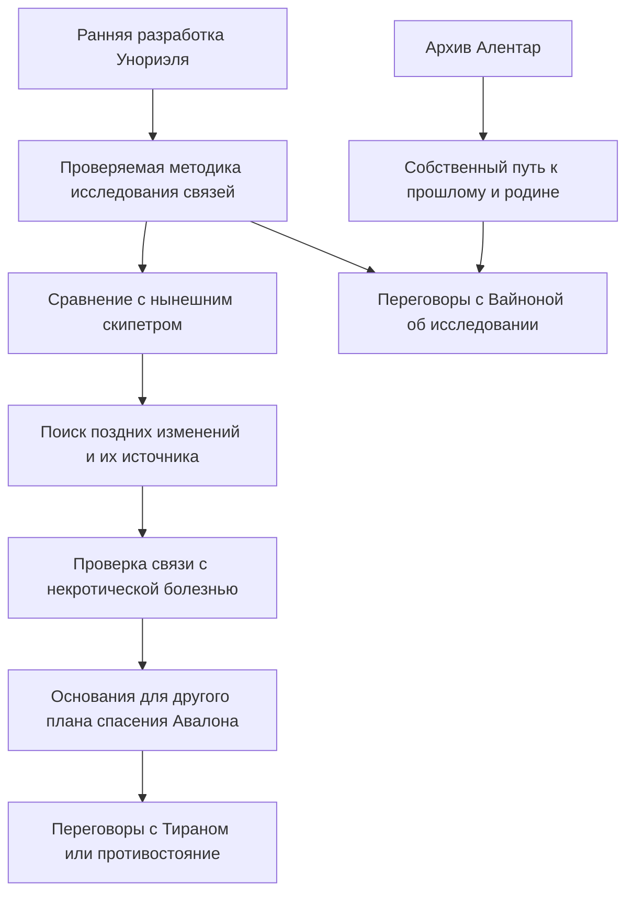

# Унориэль: функции экспедиции и игровые ситуации

> **Архив предыдущего варианта.** Для игры используйте [«Город за двумя щитами»](<Унориэль — город за двумя щитами.md>). Он учитывает рассказ о первой сессии и заменяет абстрактного «служебного хранителя» конкретными персонажами. Ниже сохранён прежний ход разработки; пометки о неизвестном первом исследовании устарели.

Мастерская подготовка от 18 сентября 2026 года. **Все новые сцены, NPC, устройства, находки и последствия ниже — предложения для обсуждения.** Они не внесены в канон. Подтверждённые основания собраны отдельно: [«Опорные сведения из книг»](<Унориэль — опорные сведения из книг.md>).

Первое исследование уже сыграно, но его пересказа пока нет. Поэтому это набор совместимых ситуаций, из которого после рассказа мастера выбирается продолжение. Его нельзя использовать как запись произошедшего или повод заново проводить уже пройденные эпизоды.

## 1. Какую перемену должна дать экспедиция

**К концу Унориэля у героев должен появиться собственный способ действовать в истории со скипетром и болезнью.** Сейчас крупные силы знают больше, предлагают условия и используют группу. Экспедиция может изменить это соотношение: герои получат знания, которые сумеют проверить, сохранить, передать и применить по своему решению.

Главный вопрос приключения: **можно ли использовать знание о прежнем устройстве скипетра, чтобы освобождать, а не подчинять?** Это связывает поручение Вайноны с уже пережитым героями действием предмета. Окончательное восстановление скипетра не обязано происходить здесь.

У самого города другая, человеческая сторона: щит уберёг улицы от моря, но не обеспечил жизнь внутри. Дневник позволяет пережить это через судьбу конкретного человека, а не только через описание катастрофы. Рифма с будущим планом Тирана возникает естественно; город не должен заранее доказывать, что любой щит или любой защитник плох.

| Функция | Что получают игроки | Что они могут сделать дальше |
|---|---|---|
| Продвинуть историю скипетра | Раннюю схему и работающий способ различать выбранную связь и остальные связи объекта. | Организовать исследование нынешнего предмета; искать, где и как изменили его функцию. |
| Сделать расследование болезни содержательным | Метод проверки и понимание пределов доказательства: повреждение системы и действующее заражение требуют разных проверок. | Сопоставить наблюдения унии, образцы и строение скипетра. Получить основания предлагать альтернативу переносу Древа. |
| Дать личный результат | Одну практически полезную зацепку о переносе души, теле, зависимости или пути домой. | Выбрать собственный следующий шаг, не дожидаясь очередного поручения покровителя. |
| Изменить отношения с Вайноной | Новые сведения, которыми распоряжается группа, и наблюдаемый опыт совместной работы. | Обсудить условия сотрудничества, доступ к исследованию и судьбу оригиналов. |
| Придать масштабу человеческую цену | Имена, свидетельства и конкретные решения последних дней Унориэля. | Решить, что сохранить и кому рассказать; позднее оценивать планы спасения мира с пониманием их цены. |

Для одной экспедиции достаточно первых двух функций и одной выбранной личной линии. Остальные могут развиваться короткими эпизодами. Попытка одновременно раскрыть происхождение всех героев, тайну Вотума, Эвгера, Ксокса и Миркула перегрузит Унориэль.

## 2. Состояние перед подготовкой продолжения

| Уже известно | Пока нужно восстановить по первой сессии |
|---|---|
| Заказ мастера для экспедиции — исследовать создание скипетра. | Как именно заказ был сформулирован героям и что они считают своей целью сейчас. |
| Вайнона исследует болезнь вместе с Повелителем; они не знают о скипетре у группы. | Узнала ли Вайнона что-либо новое в Унориэле; как она присутствует в экспедиции. |
| Перед выходом прозвучало ограничение на предметы с настройкой и демипланы. | Какие вещи действительно взяли, где скипетр и сфера, что стало с планом отправить их с совой. |
| У города есть исторические свидетельства о двух щитах и восточных подвалах. | Что уже увидели герои, что нашли и прочли, кого встретили и что изменили. |
| Первое исследование состоялось. | Где группа остановилась, как возвращается, какие угрозы и ресурсы уже установлены за столом. |

**Правило адаптации:** сыгранное имеет приоритет. Если группа уже побывала в нужном месте, открытие можно привязать к неразобранному материалу или следующему доступному узлу только при правдоподобной связи. Не переносить найденный уникальный предмет вслед за группой и не повторять пройденную сцену под новым названием.

## 3. Что именно предлагается раскрыть

### Основной результат: способ различать связи

В книге уже сказано, что Размыкание должно было освобождать имперских драконов. Повторить этот факт в древней библиотеке недостаточно. Нужен новый практический результат.

**Предложение об исходном устройстве:** в Унориэле разработали способ выделять и размыкать определённую магическую связь, сохраняя остальные. Оммаэль приспособил разработку для освобождения живых существ, прежде всего драконов; позднее в Латерии изменили воздействие на подчинение. Это согласуемая модель трёх этапов, а не уже утверждённая история.

Ранний протокол включает три операции: распознать связи, указать одну из них, проверить сохранность остальных. Герои выносят описание и результаты опыта. Это **не новый универсальный эффект**, способный без подготовки разделить Брока и Кириана, снять кровный обет, устранить влияние бога или открыть Заслон. Применимость к каждой из этих задач ещё надо исследовать.

Полезная награда — возможность сформулировать конкретный запрос: «Нам нужно узнать, какие воздействия этого предмета исходны, а какие добавлены позднее, и можно ли отключить одно, сохранив остальные». С таким запросом герои сами выбирают специалиста и условия работы.

### Результат для болезни: следующий проверяемый шаг

Архив не должен прямо сообщать, что Миркул заразил весь Авалон и новое Древо не поможет. В замкнутом городе для этого нет источника знания.

Предлагаемая ранняя схема даёт основу сравнения. После возвращения её можно сопоставить с нынешним скипетром и материалами унии. Если мастер закрепляет некротический слой, именно такое исследование способно обнаружить дополнительное воздействие, отсутствовавшее в первоначальном устройстве. Затем понадобится проверить его связь с болезнью.

В результате Унориэля возникает **основание исследовать дополнительную причину**, а не готовое доказательство полного провала Тирана. Если позднейшие проверки докажут бесполезность его плана, следующим конфликтом действительно становятся переубеждение или противостояние — как предложил мастер.

### Что лучше сохранить для дальнейших открытий

Полные условия договоров с Вотумом; его возможная связь с Ксоксом; тайна Тирми; природа Эвгера; точные условия сделки Эрина с Миркулом; всеобщий иммунитет эльфов; тождество Повелителя и Тирана. Для Унориэля не требуется раскрывать всё это сразу. Отдельную улику можно добавить, если она отвечает текущему интересу игроков, но не выдавать несколько неподтверждённых версий одним монологом.

## 4. Игровые ситуации

Эти ситуации допускают разный порядок. Дворцовый архив и мастерская связаны задачей экспедиции; аванпост — самостоятельная личная ветка. Восточные подвалы — один из путей ко дворцу, а не обязательный ключ ко всему приключению.

### А. Два щита и право на записи

**Основание:** дневник, с. 2: закрытый дворец, зелёные кроны и слух о восточном обходе. Нынешнее состояние нужно согласовать со сыгранной сессией.

**Предложенная ситуация.** За внутренним щитом сохранилась часть архива. Служебный хранитель допускает обслуживание сооружения, но запрещает вынос подлинников: он отвечает за сохранность и достоверность записей. Если подобный NPC уже существует, использовать его установленный характер; иначе это новый ограниченный механизм или архивная личность, а не автоматически Куратор из прежнего сценария.

**Зацепки на месте:** через закрытый вход виден указатель мастерской; на публичном плане обозначен служебный проход; дневник даёт независимую подсказку о восточных подвалах. Общее направление находят без обязательного броска на внимательность.

**Препятствие:** официальный допуск позволяет читать часть материалов, но не забирать технические оригиналы. Восточный путь обрушен; им можно воспользоваться после расчистки или поиска безопасного обхода. Силовой вход создаёт местную тревогу и повреждения, а не автоматически обрушает городской купол.

**Действия:** договориться о копиях; восстановить повреждённый каталог в обмен на доступ; пройти через подвалы; оспорить требование действующей имперской печати; обойти защиту или принять последствия взлома. Копии действительно достаточны для выполнения информационной задачи — хранитель не должен бесконечно придумывать новый запрет после каждого решения.

**Конкретная находка:** рядом с поздним приказом сохранять дворцовые фонды лежат обращения жителей. Среди них может быть прошение автора дневника или список его спутников — это новая предлагаемая находка, не установленный финал его судьбы. Герои решают, вынести ли и эти свидетельства, а не только полезную схему. Такая находка занимает немного времени и не отнимает награду за основную задачу.

**Результат:** доступ к ранней разработке и понимание разницы между тем, что щит сохранил, и тем, чего он не смог обеспечить. Не выдавать слух «правители сами затопили город» за установленное признание.

**Если сцена обойдена:** сведения о местонахождении мастерской доступны на публичном плане, но переговоры с хранителем и человеческие свидетельства остаются отдельной возможностью. Если дворец уже исследован, этот эпизод пропускается.

### Б. Мастерская: освобождение как проверяемое действие

**Основание:** ранняя функция Размыкания из «Истории Бладена», с. 6–8; происхождение в Унориэле — принятое направление мастера. Сама мастерская, её прибор и опыт — новые предложения.

**Предложенная ситуация.** Уцелел стационарный учебный стенд с тремя явно подписанными связями: питание небольшого механизма, удерживающий его зажим и команда движения. Это неодушевлённый образец. Чертёж объясняет, что цель опыта — снять выбранное удержание, сохранив питание и управление.

**Препятствие:** одна шкала прибора повреждена. Можно восстановить её по чертежу, наблюдать реакцию безопасного образца, изготовить замену или обойти зажим обычными средствами и сравнить результат. Информация о назначении стенда доступна сразу; проверка определяет затраты времени и качество восстановления, а не разрешение узнать основной сюжет.

**Как играть:** сначала дать игрокам описать опыт. Если они выделили нужную связь и предусмотрели проверку остальных, опыт проходит. Если воздействуют на весь узел, образец освобождается, но гаснет; если снимают только команду, перестаёт двигаться, оставаясь зажатым. Последствия видны и объяснимы, опыт можно повторить. Решение не зависит от угадывания произвольной последовательности символов.

**Выбор:** ограничиться рабочим протоколом или потратить дополнительные ресурсы на восстановление полноценного измерения. Первый вариант даёт схему и воспроизводимый пример; второй — более точную методику для специалиста. Цена дополнительных работ должна следовать из уже установленного состояния экспедиции, а не из неожиданно введённого таймера.

**Результат:** заверенная старая схема, запись результатов собственного опыта и перечень условий его применимости. Герои сделали открытие действием. Даже если историческую функцию скипетра они уже знали, теперь они умеют отличить размыкание от повреждения всего объекта.

**Если скипетра здесь нет:** это полноценное завершение сцены. Исследование самого предмета переносится на возвращение. Если предмет действительно взят и игроки хотят его применить, сначала определить известные способы контакта и опасность; не вынуждать к настройке ради обязательной улики.

**Предел:** стенд не содержит записи о будущем усилении Миркулом и не лечит персонажей. Проблема двух душ не объявляется тождественной устройству учебной игрушки.

### В. Аванпост Алентар: получить дорогу, не отдать себя

**Основание:** книга Алентар, с. 2–4. Аванпост именно здесь и состояние его систем остаются предложением, если ещё не были показаны в игре.

**Предложенная ситуация.** Уцелели архив транспортных процедур и отдельно отключённый узел связи. Архив объясняет общую схему: выбор направления, перенос души, формирование тела. Он не знает имён современных героев и не содержит их личных досье.

**Препятствие и выбор:** для чтения местных записей внешняя связь не нужна. Попытка разыскать действующий аванпост требует отправить запрос; перед отправкой система показывает, какие сведения покинут город. Ответ и сама работоспособность канала не гарантированы. Группа может забрать схему без передачи данных, отправить минимальный запрос, довериться процедуре либо искать нынешних Алентар позже в Гемме.

**Личный результат:** Эитнэ получает конкретную процедуру дальнейшего обучения и поиска, Мираж — материал для исследования заклинания воплощения, ЭО и Брок/Кириан — основание обсуждать происхождение и связь с миром назначения. Их особые роли, подтверждённые мастером, можно раскрывать постепенно. Прибор не обязан немедленно назвать каждого маяком или восстановить память.

**Роль остальных:** кто-то восстанавливает питание, кто-то проверяет карту, кто-то решает, какими сведениями безопасно поделиться. Эитнэ получает право вести этот разговор, но не превращается в единственный ключ, без которого экспедиция останавливается.

**Результат:** выбран следующий контакт или конкретный предмет исследования. Если никто не хочет раскрывать происхождение Вайноне, можно сохранить находку отдельно; её реакция зависит от того, что она действительно заметила или узнала.

**Ограничения времени:** древние записи не делят организацию на послевоенные Светлую и Тёмную ветви. Современная книга скрыта от посторонних; наличие Эитнэ не означает, что она автоматически перевела её всем. Аванпост не создаёт свободного обратного пути через Заслон по одному нажатию.

### Г. Разговор с Вайноной: герои становятся участниками исследования

**Основание:** подтверждённая задача унии, недоверие группы из писем и незнание Вайноны о нынешнем владельце скипетра.

**Момент:** безопасная остановка или возвращение с материалами. Вайнона видит, что группа добыла не только историческую справку, но и работающую методику. Её разумное предложение — передать материалы специалистам унии и продолжить исследование.

**Препятствие:** интересы частично совпадают, но герои не обязаны доверять всей организации. Вайноне нужны проверяемые сведения; группе нужны доступ к результатам и возможность действовать самостоятельно. Она не может обещать от имени Тирана отказ от неизвестного ей плана; предел её осведомлённости нужно отдельно определить.

**Предмет переговоров:** кто хранит оригиналы и копии; кто присутствует при исследовании; какие образцы будут сравнивать; что сообщают Повелителю; могут ли герои привлечь собственного специалиста. Предлагаемая уступка Вайноны — доступ к конкретным наблюдениям унии в обмен на воспроизводимую методику. Это реальная польза обеим сторонам.

**Решения и последствия:**

- Передать копии и работать вместе: уния быстрее проводит сравнение, герои получают доступ к оговорённым данным. Это полезное сотрудничество, без автоматической ловушки.
- Сохранить часть находок и искать независимую проверку: путь займёт больше усилий, зато группа сама выбирает круг осведомлённых. Вайнона судит по видимым результатам, а не по мастерским знаниям о сокрытом.
- Раскрыть наличие скипетра: предмет переговоров меняется. Вайнона может просить исследовать его, но не получает владение без решения группы. Доверие, охрана и условия исследования становятся конкретной сценой.
- Отказаться от дальнейшего сотрудничества: выданное ранее вознаграждение и обязательства определяются заключёнными договорённостями; не придумывать задним числом наказание за нежелание выполнять новый заказ.

**Результат:** следующий шаг выбирают игроки. Это может быть лаборатория унии, специалист по амманской разработке, поиск материалов Латерии или личный контакт Алентар. Точная доступность каждого пути зависит от уже установленных мест и NPC.

## 5. Короткие необязательные эпизоды

**Храм Ксокса — до 15–20 минут.** Вместо храма «Неведомого = Вотума» из старого наброска опереться на действительно описанный храм Ксокса. Предлагаемая находка — несколько разных записей о цене обращения: в одних приношение добровольное и личное, в другой поздний проситель предлагает то, чем не вправе распоряжаться. Это повод Дакире и остальным рассуждать о договорах и праве обещать чужую судьбу. Записи отражают поведение людей, а не окончательный закон бога. Не делать обязательной жертву и не выдавать родство Дакиры с Вотумом через неподтверждённую связь Ксокса и Вотума.

**Место помощи жителям — до 10–15 минут.** Если храм Афины уже введён или принят мастером, там может сохраниться список тех, кому помогали после прекращения внешней связи. Мейв решает, что сделать с именами и свидетельствами, а не слушает ещё одно подтверждение своей избранности. Полезную находку — например, безопасный внутренний маршрут — можно получить за восстановление записи. Не объявлять судьбу души Миры или автора дневника, если её ещё не определил мастер.

**След давления скипетра.** Только если мастер решил начать эту линию и установил, почему связь с предметом действует в текущем местоположении. Можно предложить игроку Брока/Кириана описать чуждый импульс или ощущение облегчения рядом с определённым некротическим следом. Игрок выбирает ответ персонажа. Сам эпизод не должен закреплять всеобщий эльфийский иммунитет или доказывать Миркула без других улик. Если скипетр далеко и механизма связи пока нет, этот эпизод лучше отложить.

## 6. Как распределить внимание между игроками

Вовлечённость создаётся сочетанием личного интереса, понятного действия и последствия. У каждого должно быть право отказаться от предложенного интереса и заняться общей задачей. Брок и Кириан делят одного игрока: два персонажа не означают две полные очереди внимания за счёт остальных.

| Персонаж | За что может зацепиться | Решение, которое принадлежит игроку |
|---|---|---|
| Брок / Кириан | Различие освобождения от разрушения, риск вмешательства в связь душ, последствия уже испытанного подчинения. | Насколько раскрывать свой опыт; что разрешать проверять; считать ли разделение общей целью или вопросом дальнейшего разговора. |
| Мейв | Люди за великими планами; цена её собственных обязательств; возможность исследования связей. | Кому помогать и доверять, какие свидетельства сохранить, участвовать ли в опытах с личными обязательствами. Схема не снимает её обеты автоматически. |
| Эитнэ | Наследие Алентар и возможность самой выбирать наставников. | Отправлять ли запрос, какие сведения сообщить, кому перевести найденное. |
| ЭО | Связь тела, личности и мира происхождения; дорога домой. | Делать ли себя объектом исследования и на каких условиях. Лаборатория не считает его имуществом по умолчанию. |
| Мираж | Устройство воплощения и различие модели, иллюзии и действующего эффекта. | Какие гипотезы проверять и с кем делиться результатами. Узнавание техники не означает автоматического воспоминания о помощи Вотуму. |
| Дакира | Обещания, принадлежность и возможность выбирать их цену. | Чьи условия принимать или оспаривать; сохранять ли сведения о личном происхождении. Не требуется немедленный ответ храма о её отце. |

При подготовке следующего вечера выбрать одну личную сцену по явному интересу игрока и две короткие возможности для других. Не проводить подряд шесть обязательных персональных откровений. В последующих сессиях внимание можно передать тем, кто сейчас занимался общей задачей.

## 7. Надёжность расследования и последствия неудач

Ключевой вывод должен опираться на независимые подтверждения, а не на единственную скрытую страницу. При этом конкретные найденные предметы сохраняют своё местоположение.

| Вывод | Доступные основания | Что остаётся недоказанным |
|---|---|---|
| Подчинение не исчерпывает историю предмета. | Выданная «История Бладена»; ранний чертёж; наблюдаемый опыт в мастерской. Последние два — предложения. | Что любые поздние свойства можно безопасно отменить. |
| Чтобы вмешаться, сначала нужно различить связи. | Аннотация протокола; устройство стенда; собственное сравнение результатов опытов. | Что связь двух душ или кровный обет устроены так же, как стенд. |
| Технология переноса души с созданием тела существует. | Книга Алентар; предложенный архив процедур; будущая проверка у действующих Алентар. | Что каждая особенность героев возникла именно так. |
| Сохранность защищённого места не равна благополучию жителей. | Дневник; следы выдачи продовольствия; записи дворца, если введены. | Злой умысел всех правителей или полная бесполезность их действий. |

Неудачные проверки могут стоить времени, ресурса, шумного доступа или точности копии. Они не должны единственным броском закрывать всю историю скипетра. Отступление с неполным результатом допустимо: одна схема без стенда всё ещё задаёт дальнейшее исследование; описание стенда без подлинника можно проверить позднее. За тщательную работу давать больше точности и независимости, а не просто ещё один обязательный ключ.

Один понятный источник давления на вечер достаточен. Использовать уже введённую нестабильность выхода, местного хранителя или ограничение экспедиционного ресурса. Не вводить одновременно несколько новых шкал и не отнимать воздух за обсуждение игроков. Установленные способы решения магией и снаряжением должны работать в своих пределах.

## 8. Что связывает Унориэль с дальнейшей кампанией

Стрелки обозначают возможные шаги исследования, не гарантированные открытия и не обязательный маршрут кампании. Выход к Миркулу требует отдельного доказательства происхождения позднего воздействия. Выход к Вотуму — исследования происхождения героев и их забытых договоров. Они пересекаются через выбор группы, а не потому, что древний архив знает всех действующих лиц.

Книга «Мир в небесах» даёт ещё один конкретный следующий ход: узнать в Гемме о связи с Новым Содденом. Оптическое сообщение короткое и медленное, но сама возможность задать проверяемый вопрос о родине уменьшает зависимость от рассказов покровителей. Доступ к установке, адресат и ответ — отдельная игровая задача.

## 9. Минимальная подготовка следующей сессии

После пересказа первого визита заполнить: точка остановки; полученные улики; принятые решения; нынешняя цель группы; известные угрозы; местонахождение важных предметов; оставшиеся ресурсы. Отдельно отметить новые замыслы мастера, которые ещё не происходили.

Для ближайшего вечера подготовить только:

1. Два видимых направления от текущего места и понятную пользу каждого.
2. Одну основную ситуацию из раздела 4 и запасное развитие при обходе препятствия.
3. Один личный интерес, который игрок уже проявлял, и возможность другого персонажа реально помочь.
4. Одну краткую находку, которую можно унести: схема, протокол опыта, перечень записей или адрес дальнейшего поиска.
5. Реакцию Вайноны на реально полученные сведения и одно достижимое улучшение условий сотрудничества.

Для каждой выбранной сцены полезна короткая запись результата: **что герои узнали; на основании чего; что решили; что из-за этого изменилось; какую возможность получили**. Это станет основой следующего обновления канона и подготовки.

## 10. Сюжетная оценка

Унориэль хорошо связывает нынешний предмет, личные потери героев и большую историю. Самая сильная связь уже заложена в источниках: артефакт, предназначенный для освобождения, превратился в инструмент власти. Это относится к пережитому группой опыту, поэтому исследование может быть их собственным делом даже при недоверии к Вайноне.

Эпичность здесь лучше строить на действии с последствиями: герои впервые воспроизводят забытый принцип, выбирают, кому доверить знание, и начинают исследование, которое способно изменить решение сильнейшего защитника Авалона. Для этого не требуется немедленно столкнуть их с богом или дать окончательный ответ на устройство всех девяти миров.

Главный риск — добавить ещё много обещаний будущих разгадок. Поэтому результат экспедиции должен включать хотя бы одну завершённую маленькую задачу: понятный опыт, добытую рабочую запись или установленный контакт. И хотя бы одну новую возможность, которую игроки вправе использовать без разрешения очередного покровителя.
